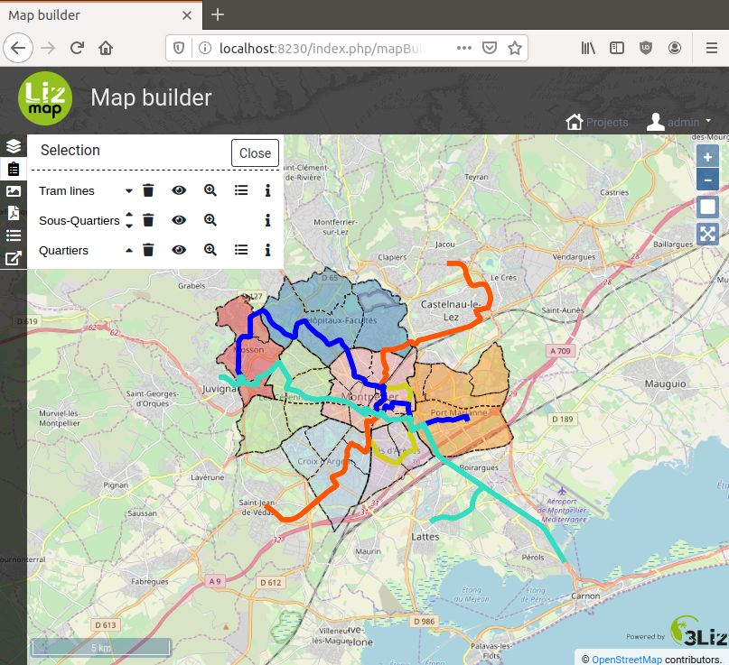

# MapBuilder module

[](https://github.com/3liz/lizmap-mapbuilder-module/actions/workflows/release.yml)
[](https://packagist.org/packages/lizmap/lizmap-mapbuilder-module)



You can have a look at our [map builder demo](https://demo.lizmap.com/mapbuilder/).
* OSM project
* Local Urbanism Plan project
* Combine these two projects into a single one using the Map Builder

* MapBuilder 2.0.0 is compatible with Lizmap Web Client 3.4, 3.5 and experimentaly with Lizmap 3.6
* MapBuilder 1.1.x is compatible with Lizmap Web Client 3.3 and 3.2

## Installation

Since version 2.0.1, it is recommended to install the module 
with [Composer](https://getcomposer.org), the package manager for PHP.
If you can't use it or if you are using Lizmap 3.3 or lower, use the manual way to
install the module (jump to the corresponding section below)

### Automatic installation with Composer and lizmap 3.4 or higher

* into `lizmap/my-packages`, create the file `composer.json` (if it doesn't exist)
  by copying the file `composer.json.dist`, and install the modules with Composer:

```bash
cp -n lizmap/my-packages/composer.json.dist lizmap/my-packages/composer.json
composer require --working-dir=lizmap/my-packages "lizmap/lizmap-mapbuilder-module"
```

* Then go into `lizmap/install/` and execute Lizmap install scripts :

With Lizmap 3.6 and higher, first execute:

```bash
php configure.php mapBuilder
php configure.php mapBuilderAdmin
```

then, for Lizmap 3.4, 3.5, 3.6 and higher:

```bash
php installer.php
./clean_vartmp.sh
./set_rights.sh
```

* Go to the administration of Lizmap with your browser to configure mapBuilder


### Manual installation into lizmap 3.3 or 3.4 without Composer

* Download the zip archive from the [release page into GitHub](https://github.com/3liz/lizmap-mapbuilder-module/releases).
* Extract files from the archive and copy directories `mapBuilder` and `mapBuilderAdmin` into `lizmap/lizmap-modules/` of Lizmap.
* Edit the following files from  `lizmap/var/config/`:

Add this to `localconfig.ini.php` into the `[modules]` section

```ini
mapBuilder.access=1
mapBuilderAdmin.access=1
```

Add this to `index/config.ini.php` into the `[modules]` section

```ini
mapBuilder.access=2
```

Add this to `admin/config.ini.php` into the `[modules]` section

```ini
mapBuilderAdmin.access=2
```

* Then execute Lizmap install scripts into `lizmap/install/` :

```bash
php installer.php
./clean_vartmp.sh
./set_rights.sh
```

* Go to the administration of Lizmap with your browser to configure mapBuilder
